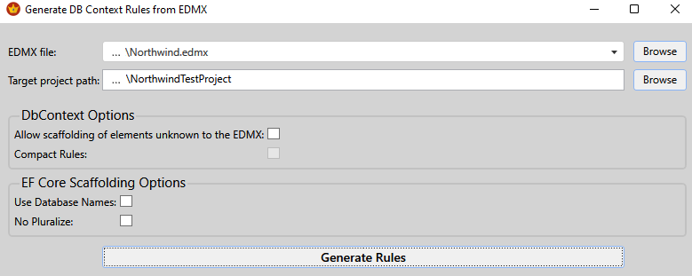
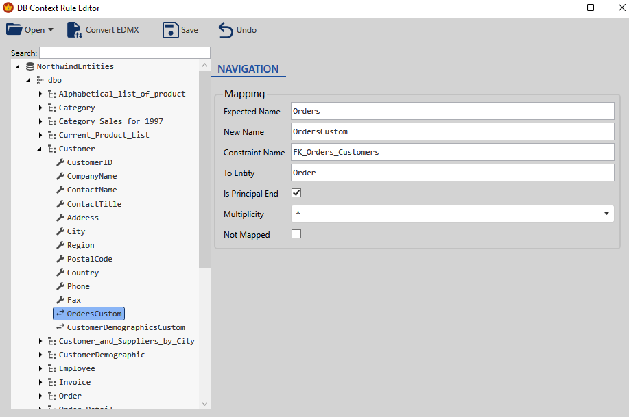

# Entity Framework Ruler - Editor

**Now available as a [Visual Studio Extension](https://marketplace.visualstudio.com/items?itemName=Randell.EF-Ruler).**

Automate the customization of the EF Core Reverse Engineered model. Supported changes include:
- Class renaming
- Property renaming (including both primitives and navigations)
- Type changing (useful for enum mapping)
- Skipping non-mapped columns.
- Forcing inclusion of simple many-to-many entities into the model.

EF Ruler applies customizations from a rule document stored in the project folder.  Rules can be fully generated from an EDMX (from old Entity Framework) such that the scaffolding output will align with the old EF6 EDMX-based model.

>"EF Ruler provides a smooth upgrade path from EF6 to EF Core by ensuring that the Reverse Engineered model maps perfectly from the old EDMX structure."

-------
### Upgrading from EF6 with EDMX:
1) Install the [Visual Studio Extension](https://marketplace.visualstudio.com/items?itemName=Randell.EF-Ruler), right click on an EDMX and go to _Convert EDMX to DB Context Rules_. 
2) Reference [EntityFrameworkRuler.Design](https://www.nuget.org/packages/EntityFrameworkRuler.Design/) from the EF Core project.
3) Run the [ef dbcontext scaffold](https://learn.microsoft.com/en-us/ef/core/managing-schemas/scaffolding/?tabs=dotnet-core-cli) command and the design-time service will do the rest.

-------
### Initializing DB Context Rules _Without_ an EDMX:
1) Reference [EntityFrameworkRuler.Design](https://www.nuget.org/packages/EntityFrameworkRuler.Design/) from the EF Core project.
2) Run the [ef dbcontext scaffold](https://learn.microsoft.com/en-us/ef/core/managing-schemas/scaffolding/?tabs=dotnet-core-cli) command and the design-time service will do the rest.  By default, if no rule file found, a complete model is generated based on the current EF Core model.  The rules can then be modified, and applied by re-running the [scaffold](https://learn.microsoft.com/en-us/ef/core/managing-schemas/scaffolding/?tabs=dotnet-core-cli) command.

-------
### DB Context Customization and Ongoing DB Maintenance

1) With [VS Extension](https://marketplace.visualstudio.com/items?itemName=Randell.EF-Ruler) installed, right click on the json rules file and go to _Edit DB Context Rules_.
2) Adjust the model as necessary using the editor UI.  

-------
### Applying Model Customizations:
1) Reference NuGet package [EntityFrameworkRuler.Design](https://www.nuget.org/packages/EntityFrameworkRuler.Design/) from the EF Core project.  This is a Design-Time reference, meaning EF Core can use it during the scaffolding process but the assembly will NOT appear in the project build output. 
2) Run the [ef dbcontext scaffold](https://learn.microsoft.com/en-us/ef/core/managing-schemas/scaffolding/?tabs=dotnet-core-cli) command and the design-time service will apply all changes as per the json rule file.

-------
### Adding/Removing Tables From the Model:
By default, a rule file generated from EDMX limits tables and columns to just what was in the EDMX.  That way, an identical model can be generated.

If it's time to add a table or column to the model, adjust the IncludeUnknownTables/IncludeUnknownColumns flags at the relevant level.

If the database schema contains a lot of tables that you don't want to generate entities for, then enabling IncludeUnknownTables is not a good idea.  Instead, manually create the table entry in the rule file (using the Editor UI) and set IncludeUnknownColumns to true.  On the next scaffold, the entity and table rules will be generated fully.  

You can remove entities from the model by marking the corresponding table (or column) as _Not Mapped_.

-------

### Entity Configuration Splitting:
The [ef dbcontext scaffold](https://learn.microsoft.com/en-us/ef/core/managing-schemas/scaffolding/?tabs=dotnet-core-cli) command does not natively support splitting entity type configurations into separate files.  Instead, all type configurations are stored in the same file as the context.

With EF7, [EntityFrameworkRuler.Design](https://www.nuget.org/packages/EntityFrameworkRuler.Design/) can split configurations for you.

Just enable "SplitEntityTypeConfigurations" in the rule file (at the root level).

-------

This project is under development!  Check back often, and leave comments [here](https://github.com/R4ND3LL/EntityFrameworkRuler/issues).
